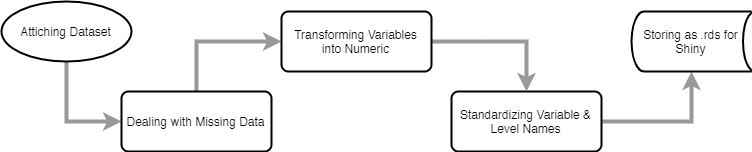
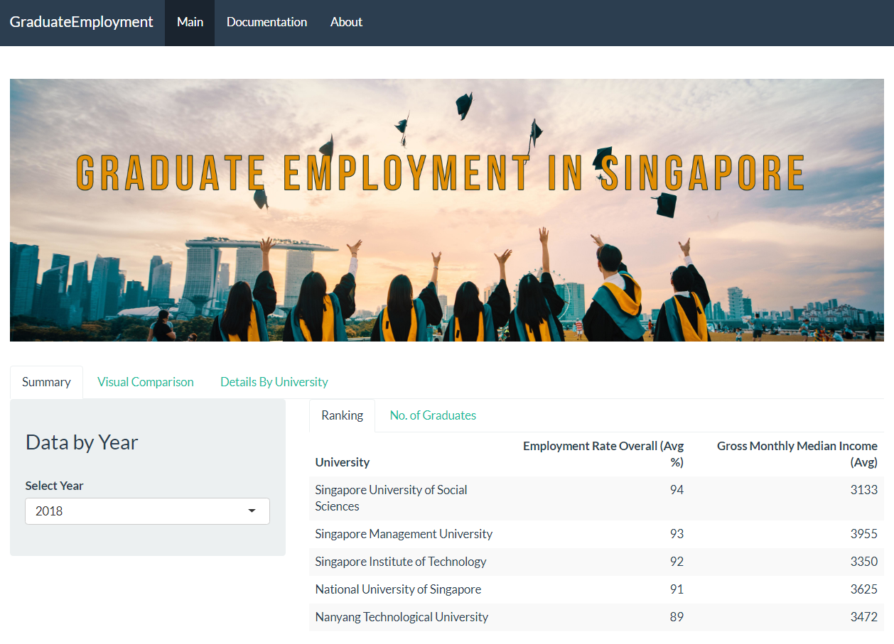
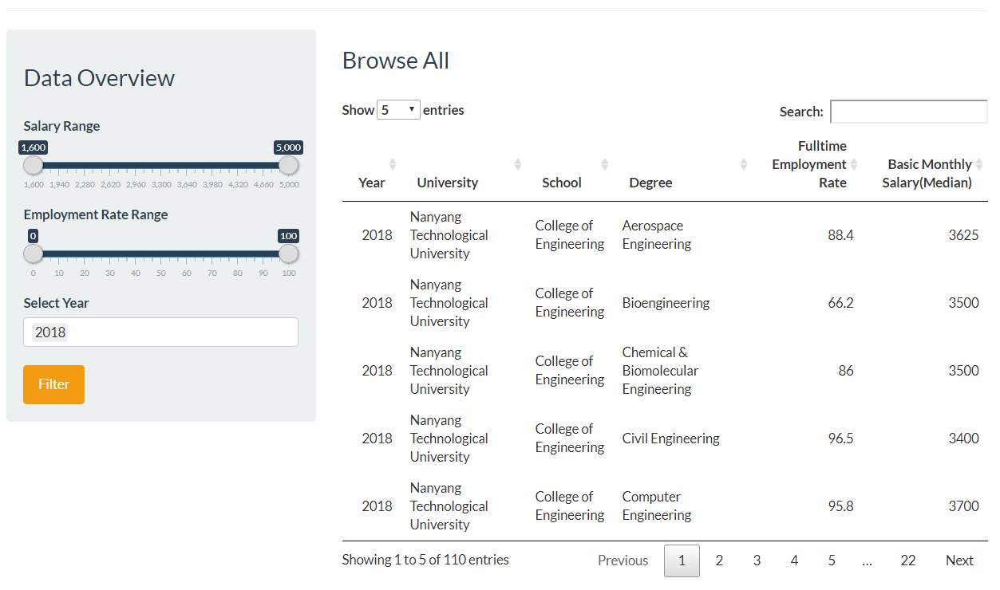
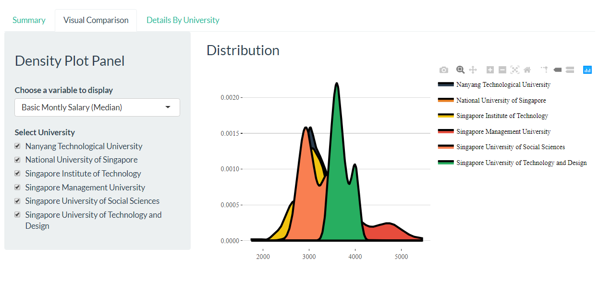
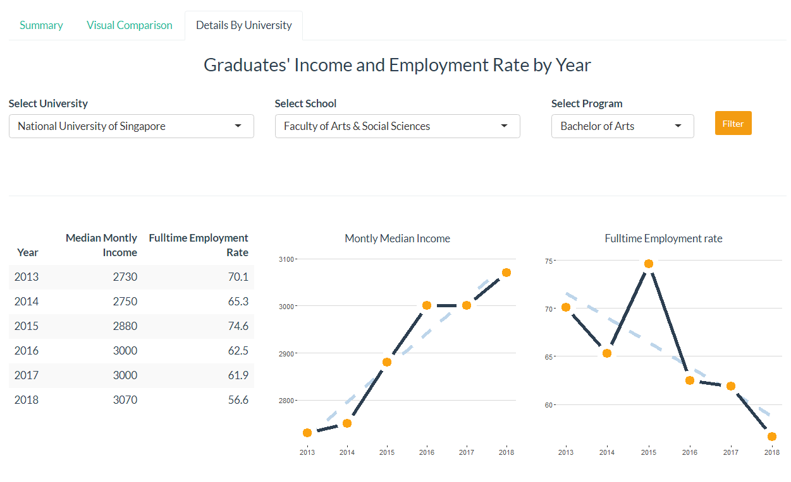

```{r global_options, include=FALSE}
knitr::opts_chunk$set(warning=FALSE)
```

# Content 

1. Brief Introduction
2. Data Sources
3. Technologies Used
4. Data Transformation
    + Main Libraries
    + Graduate Employment Dataset
    + Visualizations Part 1
    + Graduates by institutions
    + Visualizations Part 2
5. Shiny Application
6. Deployment
7. References


## 1. Brief Introduction

>This dashboard is built in R Shiny and used R Markdown to publish on this website. 
This is the documentation of web application that describes technical details of how the application was built, how was data cleaned and organized to load for the visualizations of this dashboard.


##### **How to see information on the website:**


## 2. Data Sources

The Graduate Employment Survey (GES) is jointly conducted by NTU, NUS, SMU, SIT (from 2014), SUTD (from 2015) and SUSS (from 2018) annually to survey the employment conditions of graduates about **six months** after their final examinations. 

Graduates from NTU, NUS, SMU and SUSS are surveyed in Nov. Due to their different academic calendars, graduates from SUTD and SIT are surveyed in Feb and Mar.

The Ministry of Education of Singapore (MOE) publishes the results of key employment indicators of the survey. 

Graduate employment survey dataset can be found here: [data.gov.sg/ges](https://data.gov.sg/dataset/graduate-employment-survey-ntu-nus-sit-smu-suss-sutd)

Number of graduates by university dataset can be found here: [data.gov.sg/gra](https://data.gov.sg/dataset/universities-intake-enrolment-and-graduates-by-course)


The **main components** of the analysis are:

* Employment Rate
* Monthly Gross Income


## 3. Technologies Used


## 4. Data Transformation

Firstly, we will work on **graduate employment dataset**.

Steps of data transformation:




* Attaching Dataset
* Dealing with missing data 
* Transforming Variables into Numeric
* Standardizing Variables & Level Names
* Storing as `.rds` file for visualizations in Shiny 

Secondly, we will work on **graduates by institution** dataset with the same same manipulations but adding `melt` function to make data tidy.

For full information please refer to [DataWrangling.R](https://github.com/LashaGoch/R-Shiny-App-Graduate-Employment-Singapore/blob/master/DataWrangling.R) file.


### Main Libraries 

```{r error = F, warning = F, message = F}
library(DT)
library(knitr)
library(kableExtra)
library(dplyr)
library(ggplot2)
library(dplyr)
library(tidyr)
library(reshape2)
library(reshape)
library(purrr)
library(knitr)
library(kableExtra)
library(ggthemes)
library(plotly)
```

### Graduate Employment Dataset

First, we import the graduate employment dataset.

```{r}
data <- readRDS("data/employment_data.rds")
tail(data)[1:3]

```

Check the dimension of the dataframe.

```{r}
dim(data)
```

### Visualizations Part 1

Let's see the summary data ranking of universities by Employment Rate Overall and Gross Monthly Median Salary. 

```{r}
data %>%
      filter(year == "2018") %>%
      group_by(university) %>%
      select(university,
             employment_rate_overall,
             gross_monthly_median) %>%
      summarise_all(funs(mean)) %>%
      mutate_if(is.numeric, round, 0) %>%
      arrange(desc(employment_rate_overall)) %>%
      kable(
        "html",
        col.names = c(
          "University",
          "Employment Rate Overall (Avg %)",
          "Gross Monthly Median Income (Avg)"
        )
      ) %>%
      kable_styling(c("striped", "hover"), full_width = T)

```


Let's see full table of Fulltime Employment and Balance Monthly Salary (Median) by Universities, their Schools and Degrees in 2018.   


```{r}

    data %>%
      filter(year== "2018") %>% 
      select(1,2,3,4,6,8) %>% 
      datatable(., rownames = FALSE, class = "table",
        options = list(pageLength = 5, scrollX = T),
        colnames = c("Year", "University", "School", "Degree", 
                     "Fulltime Employment Rate", "Basic Monthly Salary(Median)"))

```

Let's dive deeper into the details of National University of Singapore and list the basic monthly median income for each school. And we can see from the plot that graduates from College of Law earn the most.


```{r}
monthly <- data %>%
      filter(university == "National University of Singapore") %>%
      group_by(school) %>%
      summarise_at(.vars = names(.)[7:8], .funs = c(mean = "mean"))
    
colmap <-
      c("#2c3e50","#e67e22","#f1c40f","#e74c3c","#F97F51","#27ae60",
        "#2980b9","#86BBD8","#8e44ad","#95a5a6","#f39c12","#d35400",
        "#c0392b","#bdc3c7","#D6A2E8","#25CCF7","#16a085")
    
p <- monthly %>%
      data.frame() %>%
      ggplot(., aes(x = reorder(school, basic_monthly_median_mean),
               y = basic_monthly_median_mean,fill = school)) +
      geom_bar(stat = "identity", width = 0.5, color = "black", size = 1) +
      scale_fill_manual(values = colmap) +
      theme_hc() +
      theme(legend.position = "none", axis.title.x = element_blank(),
        axis.title.y = element_blank())
    
ggplotly(p + coord_flip(), tooltip = ("basic_monthly_median_mean"))

```


The following Scatter Plot shows each university in two dimensions Basic Monthly Median and Employment Rate, year = 2018

```{r}
colmap <- c("#2c3e50","#e67e22","#f1c40f","#e74c3c","#F97F51","#27ae60")

data <- data %>% filter(year=="2018")

k <- ggplot(data, aes(x = basic_monthly_median,
          y = employment_rate_ft_perm,color = university,
          shape = as.factor(year))) +
      geom_point(size = 3, alpha = 0.7) +
      scale_colour_manual(values = colmap) +
      theme_hc() +
      theme(legend.title = element_blank(),
        axis.title.x = element_blank(),
        axis.title.y = element_blank())
    
ggplotly(k, tooltip = c("year", "basic_monthly_median", "university",
        "employment_rate_ft_perm"), height = 800)
  
```

### Graduates by institutions {.tabset}

#### Data load

Let's load the data to transform.

```{r}
data_g <- read.csv('data/graduates_by_institutions.csv')
tail(data_g)[1:7]
```

#### Melt

We can see that universities are in each column. To make data tidy we will created university column with melt function.

```{r}
data_g <- melt(data_g, id = c("year", "sex"))
colnames(data_g)[3:4] <- c("university", "graduates")
head(data_g)
```

#### Clean & Transform

Now we have universities in the column "university". This is data to create Pie Chart where we will display No. of Graduates by Universities.

```{r}
## Also, we have "-" special character in the values
## Let's replace that with "NA" and then remove from data
data_g[data_g=="-"]<- NA
## Remove NA
data_g <- drop_na(data_g)
## Transform value column from character into numeric variable
data_g <- data_g %>% modify_at(4, as.numeric)
## Let's change the variable with "university" & value with "graduates"
colnames(data_g)[3:4] <- c("university", "graduates")

```


#### Level Names

Get the titles of universities
```
levels(data_g$university)
```
Set new titles of universities

```
levels(data_g$university) <- c("National University of Singapore", 
                              "Nanyang Technological University",
                              "Singapore Management University", 
                              "Singapore Institute of Technology",
                              "Singapore University of Technology and Design", 
                              "Singapore University of Social Sciences", 
                              "National Institute of Education",
                              "Singapore Politechnic", "Ngee Ann Polytechnic", 
                              "Temasek Polytechnic", "Nanyang Polytechnic", 
                              "Republic Polytechnic", "Lasalle Diploma", 
                              "Lasalle Degree", "Nafa Diploma", 
                              "Nafa Degree", "Institute of Technical Education")

```

### Visualizations Part 2

```{r}
colmap <-
      c("#bdb2ff","#ffc6ff","#fffffc","#33658A","#3a506b",
        "#577590","#43aa8b","#90be6d","#f9c74f","#f8961e",
        "#f3722c","#f94144","#ffadad","#ffd6a5","#fdffb6",
        "#caffbf","#a8dadc")

data_g %>%
      filter(year == "2018") %>% 
      group_by(university) %>%
      tally(graduates) %>%
      ggplot(aes(x = "", y = n, fill = university)) +
      geom_bar(stat = "identity", width = 1, 
               color = "black", size = 1) +
      theme_void() +
      theme(legend.position = "right",
            plot.title = element_text(hjust = 0.5, size = 14)) +
      coord_polar("y", start = 0) +
      scale_fill_manual(values = c(colmap)) +
      labs(title = "Universities by number of graduates")

```

## 5. Shiny Application

Front page of Shiny Application:










For full codes please refer the [GitHub repository](https://github.com/LashaGoch/R-Shiny-App-Graduate-Employment-Singapore). Code for front-end: [ui.R](https://github.com/LashaGoch/R-Shiny-App-Graduate-Employment-Singapore/blob/master/ui.R) and code for back-end: [server.R](https://github.com/LashaGoch/R-Shiny-App-Graduate-Employment-Singapore/blob/master/server.R).


## 6. Deployment

The application is deployed on https://www.shinyapps.io/ web server. Web application can be accessed directly from the URL: https://gesurvey.shinyapps.io/Graduate-Employment-Survey/


## 7. References

[1] Class materials provided by Piotr Wójcik PhD and Piotr Ćwiakowski Mgr at the course "Advanced R", University of Warsaw, 2020

[2] [Advanced R](https://adv-r.hadley.nz/), Hadley Wickham

[3] [R for Data Science](https://r4ds.had.co.nz/), Garrett Grolemund, Hadley Wickham 

[4] [R Markdown: The Definitive Guide](https://bookdown.org/yihui/rmarkdown/), Yihui Xie, J. J. Allaire, Garrett Grolemund

[5] [Shinyapps.io - Getting started](https://shiny.rstudio.com/articles/shinyapps.html?_ga=2.133710926.1327692135.1590531957-1674021489.1588537036), Andy Kipp

[6] [Dynamic Documents for R using R Markdown](https://rstudio-pubs-static.s3.amazonaws.com/322222_022f4f9c9ebb4b92bb4d6d2cf93d6dc9.html), Manuel Oviedo de la Fuente

[7] [Combining Shiny & R Markdown](https://beta.rstudioconnect.com/content/2671/Combining-Shiny-R-Markdown.html), R Studio

[8] [Graduate employment survey](https://data.gov.sg/dataset/graduate-employment-survey-ntu-nus-sit-smu-suss-sutd), Government of Singapore

[9] [Number of graduates by university](https://data.gov.sg/dataset/universities-intake-enrolment-and-graduates-by-course), Government of Singapore
